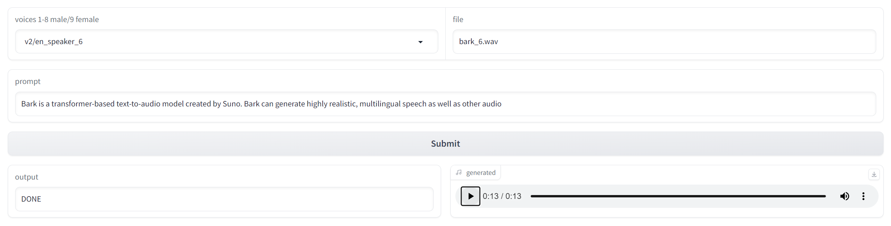

## Testing BARK

Creating a basic gradio app to create audio-text using [Bark]('https://github.com/suno-ai/bark').



### Docker

Build container:

```bash
docker build -t bark .
```

Container launch default:

```bash
docker run -ti -p 7860:7860 -p 443:443 -v /path/to/store/generated/files/:/output --gpus all bark
```

Container launch long_text app:

```bash
docker run -ti -p 7860:7860 -p 443:443 -v /path/to/store/generated/files/:/output --gpus all  -e "LAUNCH_APP=app_long_text.py" bark
```

### Browser 

Open your brother using the provided gradio url.


### Final result integrate in AI audio driven video

Sample generated using [D-ID]('https://d-id.com/').

https://youtube.com/shorts/YwRJgkuVTFQ?feature=share

